Channel Rack
=============

.. module:: pyflp.channel
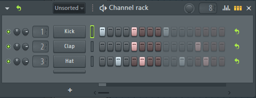
.. autoclass:: ChannelRack
   :members:

Channel Types
-------------

.. autoclass:: Channel
   :members:

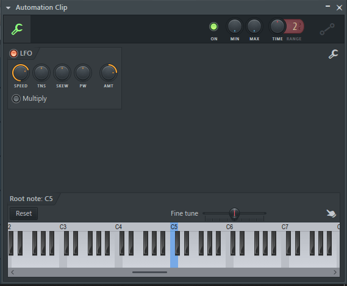
.. autoclass:: Automation
   :members:

.. autoclass:: Instrument
   :members:

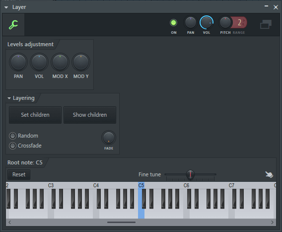
.. autoclass:: Layer
   :members:

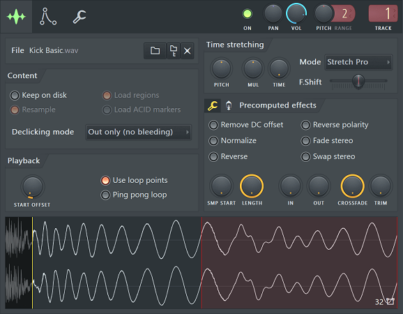
.. autoclass:: Sampler
   :members:

.. autoclass:: DisplayGroup
   :members:

Classes
-------

These implement functionality used by :class:`Channel` or its subclasses.

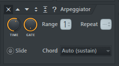
.. autoclass:: Arp
   :members:

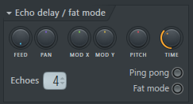
.. autoclass:: Delay
   :members:

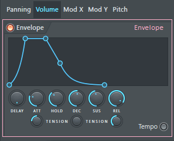
.. autoclass:: Envelope
   :members:

.. tab-set::

   .. tab-item:: Page 1

      .. image:: img/channel/fx1.png

   .. tab-item:: Page 2

      .. image:: img/channel/fx2.png

.. autoclass:: FX
   :members:

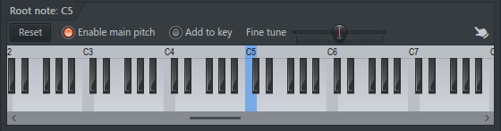
.. autoclass:: Keyboard
   :members:

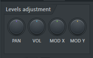
.. autoclass:: LevelAdjusts
   :members:

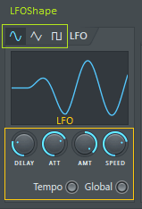
.. autoclass:: LFO
   :members:

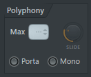
.. autoclass:: Polyphony
   :members:

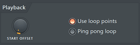
.. autoclass:: Playback
   :members:

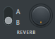
.. autoclass:: Reverb
   :members:

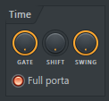
.. autoclass:: Time
   :members:

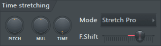
.. autoclass:: TimeStretching
   :members:

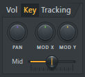
.. autoclass:: Tracking
   :members:

Enumerations
------------

.. autosummary::
   :nosignatures:

   ArpDirection
   ChannelType
   LFOShape
   ReverbType

.. autoclass:: ArpDirection
   :members:
.. autoclass:: ChannelType
   :members:
.. autoclass:: LFOShape
   :members:
.. autoclass:: ReverbType
   :members:

Event IDs
---------

.. autoclass:: ChannelID
   :members:
   :member-order: bysource
.. autoclass:: DisplayGroupID
   :members:
   :member-order: bysource
.. autoclass:: RackID
   :members:
   :member-order: bysource

Exceptions
----------

.. autoexception:: ChannelNotFound
