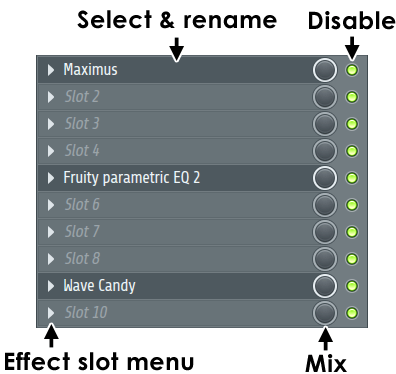
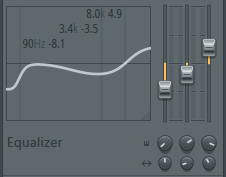

Mixer
=====

.. module:: pyflp.mixer
.. autoclass:: Mixer
   :members:

Classes
-------

.. grid::

   .. grid-item::

      .. autoclass:: Insert
         :members:

   .. grid-item::
      :child-align: end

      .. image:: img/mixer/insert/preview.png

.. autoclass:: Slot
   :members:

.. autoclass:: InsertEQ
   :members:

.. autoclass:: InsertEQBand
   :members:

Enumerations
------------

.. grid:: auto

   .. grid-item::

      .. autoclass:: InsertDock
         :members:

   .. grid-item::
      :child-align: center

      .. image:: img/mixer/insert/dock.png

Event IDs
---------

.. autoclass:: MixerID
   :members:
   :member-order: bysource
.. autoclass:: InsertID
   :members:
   :member-order: bysource
.. autoclass:: SlotID
   :members:
   :member-order: bysource
