::: pyflp.models
    options:
      show_root_heading: no
      members:
        - "__doc__"

# Arrangement

::: pyflp.models.Arrangement

## TimeMarker
::: pyflp.models.TimeMarker

::: pyflp.models.TimeMarkerType

## Track
 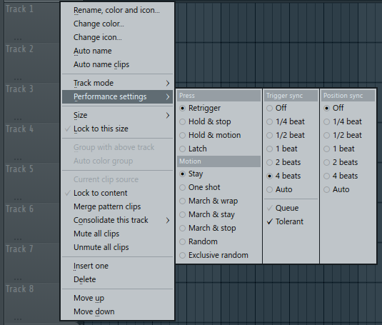
::: pyflp.models.Track
::: pyflp.models.TrackMotion
::: pyflp.models.TrackPress
::: pyflp.models.TrackSync

# Channel
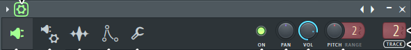
::: pyflp.models.Channel
::: pyflp.models.ChannelType

## Sample settings

### FX
 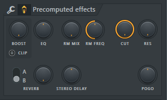
::: pyflp.models.ChannelFX
::: pyflp.models.ChannelReverb
::: pyflp.models.ChannelReverbType

### Playback settings
::: pyflp.models.ChannelPlayback

### Time stretching
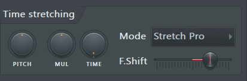
::: pyflp.models.ChannelTimeStretching

## Envelope / instrument settings
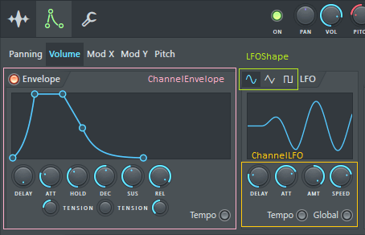
::: pyflp.models.ChannelEnvelope
::: pyflp.models.ChannelLFO
::: pyflp.models.ChannelLFOShape

## Miscellaneous functions

<!-- IMAGE GOES HERE -->

### Arpeggiator

::: pyflp.models.ChannelArp
::: pyflp.models.ChannelArpDirection

### Delay

::: pyflp.models.ChannelDelay

### Level adjustments

::: pyflp.models.ChannelLevelAdjusts

### MIDI options
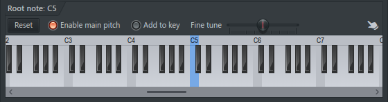
::: pyflp.models.ChannelKeyboard

### Note timing

::: pyflp.models.ChannelTime

### Polyphony
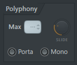
::: pyflp.models.ChannelPolyphony

### Tracking (Key / Volume)

::: pyflp.models.ChannelTracking

# Controllers
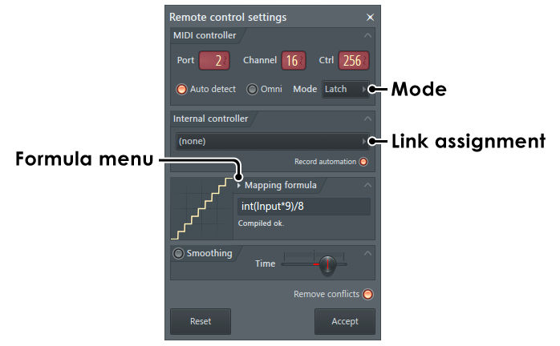
::: pyflp.models.RemoteController

# Mixer

## Insert
::: pyflp.models.Insert

::: pyflp.models.InsertDock

::: pyflp.models.InsertRoute

### EQ

::: pyflp.models.InsertEQ
::: pyflp.models.InsertEQBand

## Slot

::: pyflp.models.InsertSlot

# Plugins

## BooBass

::: pyflp.models.BooBass
    options:
      filters:
        - "!DEFAULT_NAME"

## Fruity Balance

::: pyflp.models.FruityBalance
    options:
      filters:
        - "!DEFAULT_NAME"

## Fruity Fast Dist

::: pyflp.models.FruityFastDist
    options:
      filters:
        - "!DEFAULT_NAME"
::: pyflp.models.FruityFastDistKind

## Fruity Notebook 2
[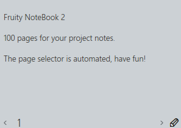](https://www.image-line.com/fl-studio-learning/fl-studio-online-manual/html/plugins/Fruity%20NoteBook%202.htm)
::: pyflp.models.FruityNotebook2
    options:
      filters:
        - "!CODEC"
        - "!DEFAULT_NAME"

## Fruity Send

::: pyflp.models.FruitySend
    options:
      filters:
        - "!DEFAULT_NAME"

## Fruity Soft Clipper
[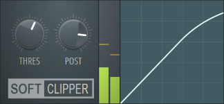](https://www.image-line.com/fl-studio-learning/fl-studio-online-manual/html/plugins/Fruity%20Soft%20Clipper.htm)
::: pyflp.models.FruitySoftClipper
    options:
      filters:
        - "!DEFAULT_NAME"

## Fruity Stereo Enhancer
[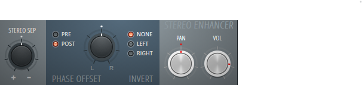](https://www.image-line.com/fl-studio-learning/fl-studio-online-manual/html/plugins/Fruity%20Stereo%20Enhancer.htm)
::: pyflp.models.FruityStereoEnhancer
    options:
      filters:
        - "!DEFAULT_NAME"

## Soundgoodizer

::: pyflp.models.Soundgoodizer
    options:
      filters:
        - "!DEFAULT_NAME"
::: pyflp.models.SoundgoodizerMode

## VST plugins
::: pyflp.models.VSTPlugin
    options:
      filters:
        - "!DEFAULT_NAME"

# Project
[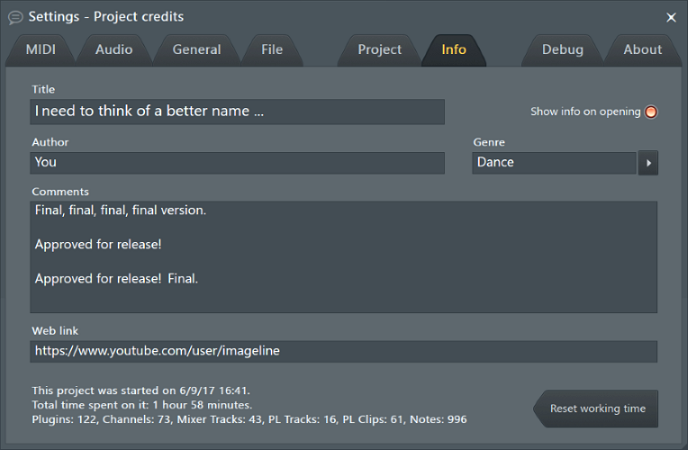](https://www.image-line.com/fl-studio-learning/fl-studio-online-manual/html/songsettings_songinfo.htm)
[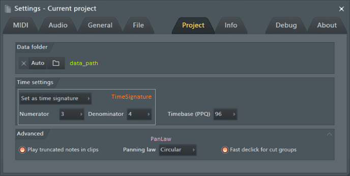](https://www.image-line.com/fl-studio-learning/fl-studio-online-manual/html/songsettings_settings.htm)
::: pyflp.models.Project
::: pyflp.models.FileFormat
::: pyflp.models.PanLaw
::: pyflp.models.Selection
::: pyflp.models.TimeSignature
