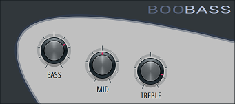
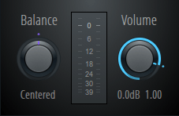
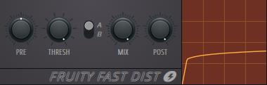
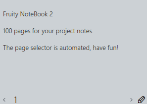
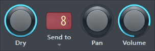
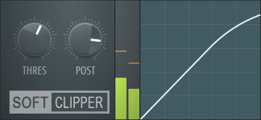
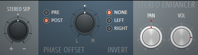

Plugins
=======

.. module:: pyflp.plugin
.. autoclass:: VSTPlugin
   :members:

   .. tab-set::

      .. tab-item:: Settings

         .. image:: img/plugin/wrapper/settings.png

      .. tab-item:: Processing

         .. image:: img/plugin/wrapper/processing.png

      .. tab-item:: Troubleshooting

         .. image:: img/plugin/wrapper/troubleshooting.png

.. autoclass:: PluginIOInfo
   :members:

Generators
----------

.. autoclass:: BooBass
   :members:

Effects
-------

.. autoclass:: FruityBalance
   :members:

.. autoclass:: FruityFastDist
   :members:

.. autoclass:: FruityNotebook2
   :members:

.. autoclass:: FruitySend
   :members:

.. autoclass:: FruitySoftClipper
   :members:

.. autoclass:: FruityStereoEnhancer
   :members:

.. autoclass:: Soundgoodizer
   :members:

Enumerations
------------

.. autoclass:: FruityFastDistKind
   :members:
.. autoclass:: StereoEnhancerEffectPosition
   :members:
.. autoclass:: StereoEnhancerPhaseInversion
   :members:
.. autoclass:: SoundgoodizerMode
   :members:

Event IDs
---------

.. autoclass:: PluginID
   :members:
   :member-order: bysource
