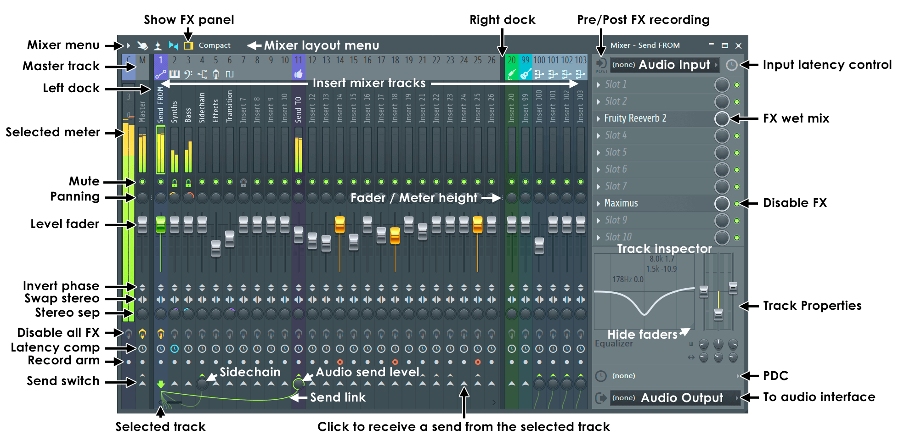
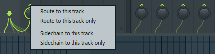

# Mixer

## Insert
::: pyflp.models.Insert
    options:
      filters:
        - "!__iter__()"

::: pyflp.models.InsertDock

::: pyflp.models.InsertRoute

### EQ

::: pyflp.models.InsertEQ
::: pyflp.models.InsertEQBand

## Slot

::: pyflp.models.InsertSlot
